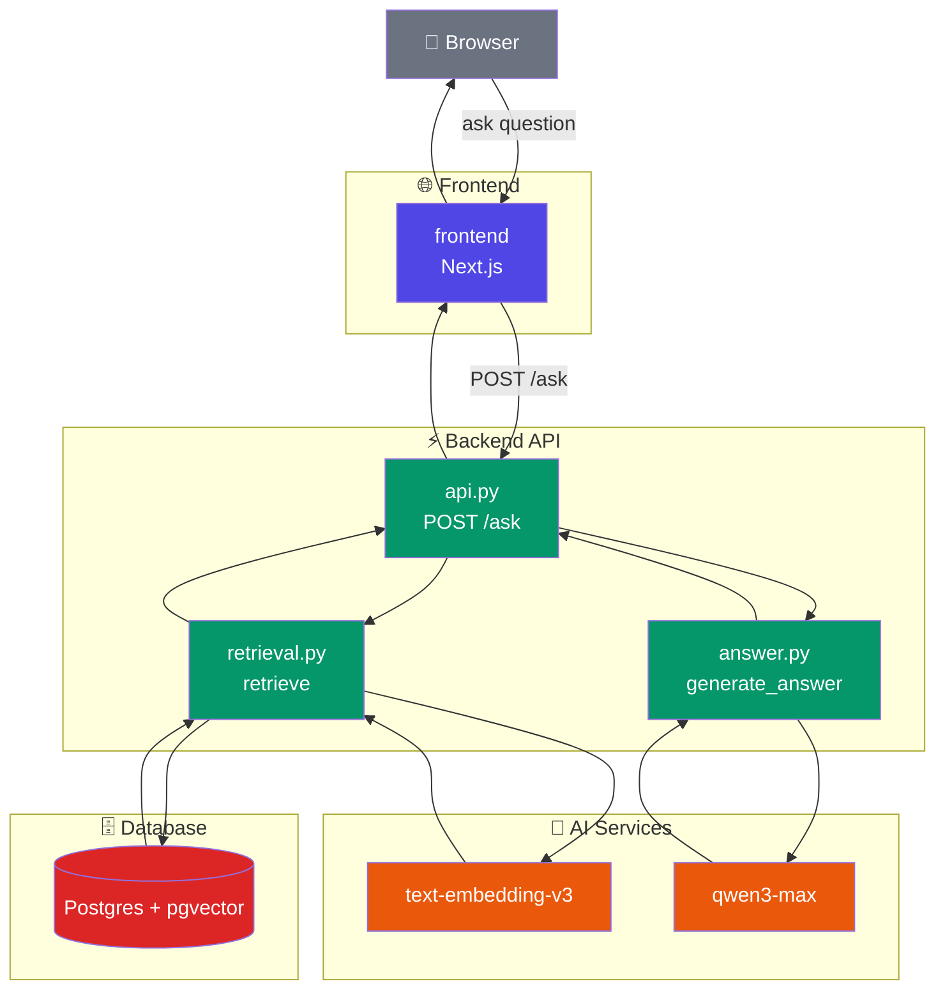
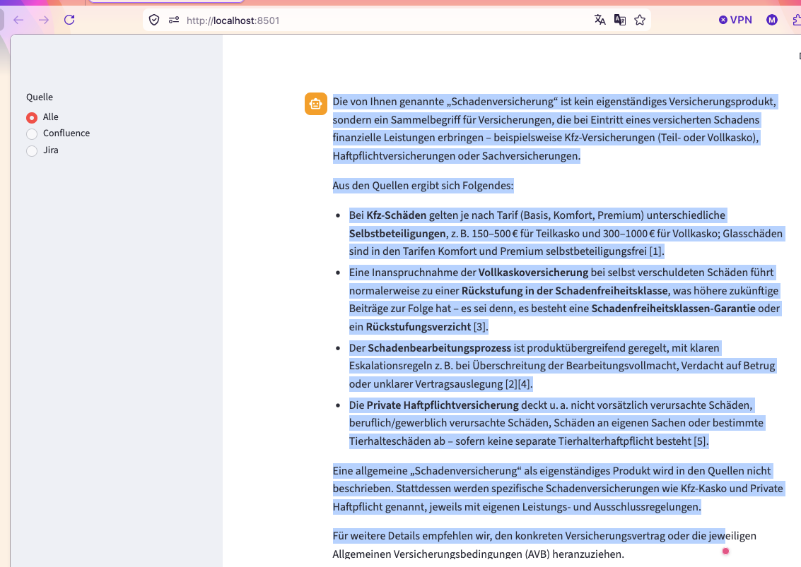
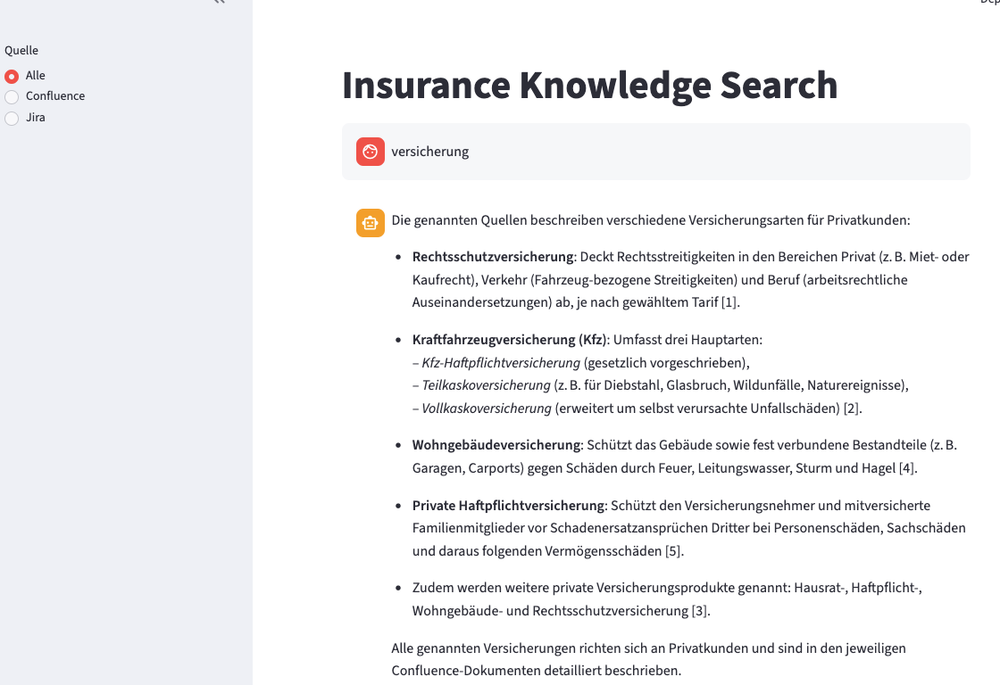
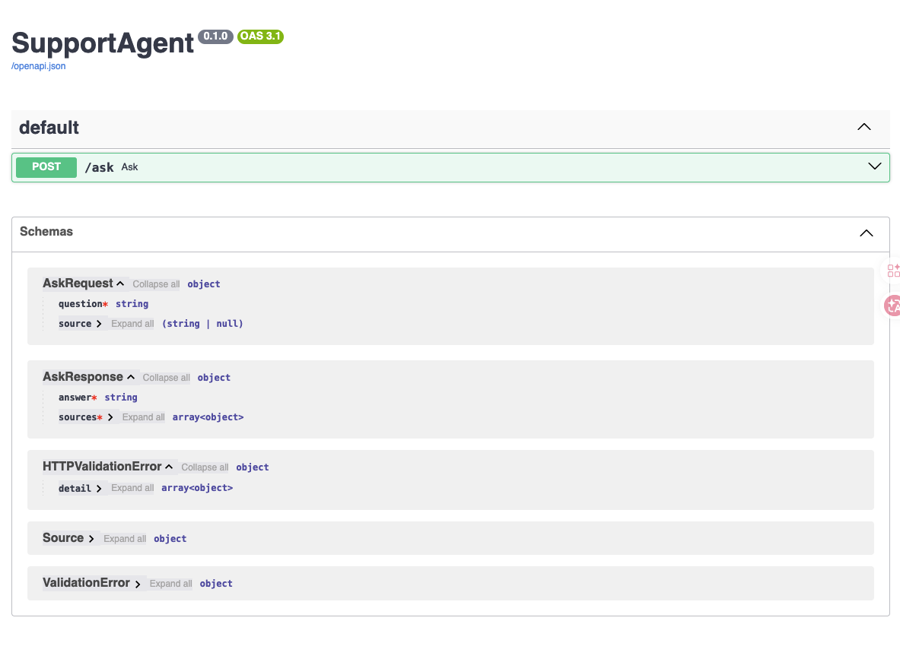
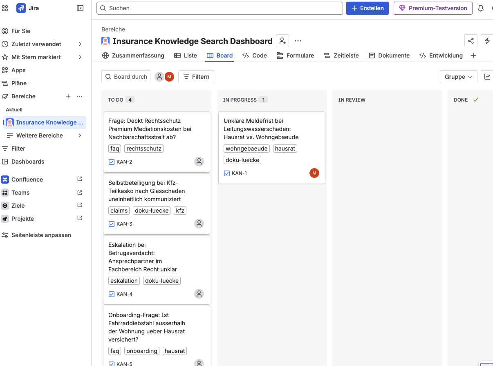

# SupportAgent

RAG pipeline over a real Confluence space + Jira project, for the
"Insurance Knowledge Search Dashboard" portfolio project. See
`architecture-proposal-v0.1.de.md` for the full design.

## Architecture (Prototype / MVP Deployment)



- `api.py` is a thin controller: it just calls `retrieve()` then `generate_answer()`.
- Two external calls go to DashScope: one to embed the question, one to generate
  the final answer from the retrieved chunks.
- The Next.js frontend proxies browser requests through `/api/ask` to the FastAPI
  backend, so no JWT or browser-side CORS setup is required for local development.

## Screenshots

Dashboard: ask a German question and get an answer with cited, expandable sources.





`/ask` API schema (FastAPI Swagger UI):



The real Jira project (KAN) backing the "documentation gap" tickets used as sources:



## Setup

```bash
python -m venv .venv
source .venv/bin/activate
python -m pip install -e .
docker compose up -d postgres
```

Copy `.env.example` to `.env` and fill in:

- `ATLASSIAN_BASE_URL`, `ATLASSIAN_EMAIL`, `ATLASSIAN_API_TOKEN` - Confluence/Jira Cloud API token
- `CONFLUENCE_SPACE_KEY`, `JIRA_PROJECT_KEY` - the space/project to read from and write to
- `EMBEDDING_API_KEY` - Alibaba Cloud Model Studio (DashScope) API key, used via its
  OpenAI-compatible endpoint (`EMBEDDING_BASE_URL`) for both embeddings and chat (`CHAT_MODEL`)
- `DATABASE_URL` - points at the pgvector container started by `docker compose up`
- `AUTH_SESSION_TTL_DAYS`, `AUTH_COOKIE_SECURE` - local email/password session
  settings. Keep `AUTH_COOKIE_SECURE=false` for plain HTTP local development and
  set it to `true` when serving behind HTTPS.

## Backend layout

The backend follows a small service-oriented layout inspired by larger agent
platforms:

- `supportagent/api/` - FastAPI app, route registration, request/response schemas
- `supportagent/auth/` - local email/password auth, session cookies, user/session tables
- `supportagent/memory/` - short-memory and long-memory schemas, SQL store, service API
- `supportagent/rag/` - ingestion, chunking, embeddings, pgvector storage, retrieval
- `supportagent/agent/` - LangGraph workflow, routing, query rewrite, evidence checks
- `supportagent/integrations/` - external service clients such as Atlassian and Langfuse
- `supportagent/core/` - shared domain models, answer generation, logging setup

## One-command local startup

After Docker Desktop is running and `.env` is configured:

```bash
python scripts/start.py
```

Use `python3 scripts/start.py` if your system does not provide `python`.

The script installs missing frontend dependencies, starts the local pgvector
Postgres container, creates the memory tables for short-memory and long-memory,
then starts FastAPI at `http://127.0.0.1:8000` and Next.js at
`http://localhost:3000`. Press `Ctrl+C` to stop the frontend and backend;
Postgres remains running.

## Testing and CI

Backend tests are regular `pytest` tests with assertions and monkeypatching for
agent dependencies. Frontend checks use TypeScript and a production Next.js
build.

```bash
python -m pip install -e ".[dev]"
pytest

cd src/frontend
npm ci
npm run typecheck
npm run build
```

GitHub Actions in `.github/workflows/ci.yml` runs backend compile/tests,
frontend typecheck/build, and backend/frontend Docker image builds on pull
requests and pushes to `main`.

## Container startup

For only the local database:

```bash
docker compose up -d postgres
```

For the containerized app stack:

```bash
docker compose --profile app up --build
```

The app profile builds `Dockerfile.backend` and `src/frontend/Dockerfile`,
starts FastAPI on `http://localhost:8000`, Next.js on `http://localhost:3000`,
and uses the same pgvector Postgres service.

## Local MCP servers

The project includes local, enumerable MCP server examples under
`supportagent/mcp_servers/`. They are intended as interview-friendly reference
servers, not default remote third-party proxies.

### Microsoft Teams / Graph MCP

`teams_mcp` mirrors the shape of the OmniAgent `lark_mcp` example, but maps the
tools to Microsoft Graph instead of Feishu/Lark:

- users: `batch_get_user_info`
- calendars: `create_calendar`, `delete_calendar`, `get_calendar_info`,
  `get_calendars_list`, `update_calendar`
- calendar events: `create_calendar_event`,
  `append_calendar_event_attendee`, `get_calendar_event`,
  `update_calendar_event`, `delete_calendar_event`
- OneDrive documents/folders: `create_document`, `get_document`,
  `create_folder`, `list_folder_files`
- Teams messages: `create_message`

Set `MS_GRAPH_ACCESS_TOKEN` or pass `access_token` to each tool. For a personal
account, an email such as `yuheydemann@outlook.de` can be used as `user_id` for
user/calendar/OneDrive tools. Sending Teams messages still requires a real
Microsoft Graph `chat_id`.

```bash
python -m supportagent.mcp_servers.teams_mcp --transport stdio
python -m supportagent.mcp_servers.teams_mcp --transport sse --host 127.0.0.1 --port 8010
```

### Google Weather MCP

`weather_mcp` exposes `get_weather(location | latitude/longitude)`. It uses
Google Geocoding when only a text location is provided, then calls Google
Weather for current conditions and daily forecast.

Set `GOOGLE_WEATHER_API_KEY` or `GOOGLE_MAPS_API_KEY`, or pass `api_key` to the
tool.

```bash
python -m supportagent.mcp_servers.weather_mcp --transport stdio
python -m supportagent.mcp_servers.weather_mcp --transport sse --host 127.0.0.1 --port 8011
```

Unlike the OmniAgent sample remote SSE entries, these servers do not auto-route
traffic through ModelScope or any unknown external MCP host. For production,
put a gateway/audit layer in front of Graph and Weather credentials before
letting users call these tools.

The chat endpoint also has a dynamic MCP path. On each `/ask`, the backend can
spawn the local MCP servers over stdio, call `list_tools`, expose allowed tools
to the chat model, execute model-selected `tool_calls` through `call_tool`, and
show those calls in the Agent trace. Write/action tools are not exposed to the
automatic agent unless `MCP_ALLOW_WRITE_TOOLS=true`.

```text
MCP config -> MultiServerMCPClient -> list_tools -> StructuredTool -> tool_calls
```

Set `MCP_DYNAMIC_TOOLS_ENABLED=false` to disable this automatic route and keep
only the manual MCP debug panel.

## Pipeline

```bash
# 1. Seed the Confluence space + Jira project with sample insurance content
python -m supportagent.seed

# 2. Pull real Confluence pages (tagged "insurance-kb") + Jira issues, normalize to Documents
python -m supportagent.rag.ingest

# 3. Chunk -> embed -> store in pgvector
python -m supportagent.rag.index
```

## RAG Answer API

```bash
uvicorn supportagent.api:app --reload
```

Register or sign in through the frontend first. The backend stores an
HTTP-only session cookie and resolves `user_id` server-side, so short memory is
scoped by `thread_id` and long memory is scoped by the authenticated user rather
than a frontend-supplied identifier.

`POST /ask` with `{"question": "..."}` retrieves relevant chunks from pgvector,
generates a German answer with citations (`[1]`, `[2]`, ...), and returns the
cited sources. If the retrieved context doesn't support an answer, it returns
a fixed controlled-refusal message instead.

### Agent workflow
The original MVP used a deterministic RAG pipeline:

  ```text
  question -> retrieve -> generate_answer
  ```

  The current version adds a minimal agent orchestration layer:

  ```text
  question
    -> route_question
    -> rewrite_query
    -> retrieve
    -> check_evidence
    -> generate_answer or controlled refusal
  ```

  **`route_question()`** decides whether the question should search Confluence,
  Jira, or both sources. The current implementation is rule-based and intentionally
  deterministic, so it is easy to test and debug.

  **`rewrite_query()`** expands user questions with insurance-domain terminology before retrieval. The rewritten query is used only for
  retrieval; answer generation still receives the original user question.

  **`check_evidence()`** validates the retrieved chunks before answer generation. If
  no chunks are retrieved, the workflow returns the controlled refusal text without
  calling the chat model.

  The FastAPI endpoint calls **`answer_with_agent()`**  instead of directly calling
  retrieval and answer generation. This keeps the API layer thin and leaves room
  for future agent steps such as query rewriting, second-pass retrieval, stronger
  evidence checks, or a LangGraph workflow.

### Evaluation

```bash
python -m supportagent.eval
```

Runs a small set of German questions (`eval_questions.py`) covering
single-source retrieval, multi-source synthesis, conflicting sources,
terminology robustness, and controlled refusal, and prints a pass/fail
report against the live pipeline.

## Frontend

```bash
cd src/frontend
npm install
npm run dev
```

A Next.js chat UI on top of `/ask` (run `uvicorn` first, see above): ask a
German question, filter by source (Confluence/Jira/all), and expand each cited
source to preview its content and open the original Confluence page or Jira
issue. Set `BACKEND_API_URL` in `src/frontend/.env.local` if the FastAPI backend
isn't on `http://localhost:8000`.

### PDF data prep

`pdf_to_confluence.py` extracts `§`-numbered sections from German insurance
terms PDFs (Musterbedingungen/AVB) into Confluence page drafts. See the
module docstring for the dry-run / save workflow.

## Project layout

- `models.py` - shared `Document` contract
- `html_utils.py`, `adf_utils.py` - Confluence storage-format HTML and Jira ADF conversions
- `atlassian_client.py` - real Confluence v2 / Jira v3 REST client
- `seed_content.py`, `seed.py` - sample data + script to create it in Confluence/Jira
- `ingest.py` - pulls real data back out and normalizes it to `Document`
- `chunking.py`, `embeddings.py`, `vector_store.py`, `index.py` - chunk/embed/store pipeline
- `src/backend/supportagent` - FastAPI, LangGraph workflow, ingestion, retrieval, and indexing code
- `src/frontend` - Next.js frontend that proxies `/api/ask` to FastAPI

## Tests

```bash
python -m pytest
```
