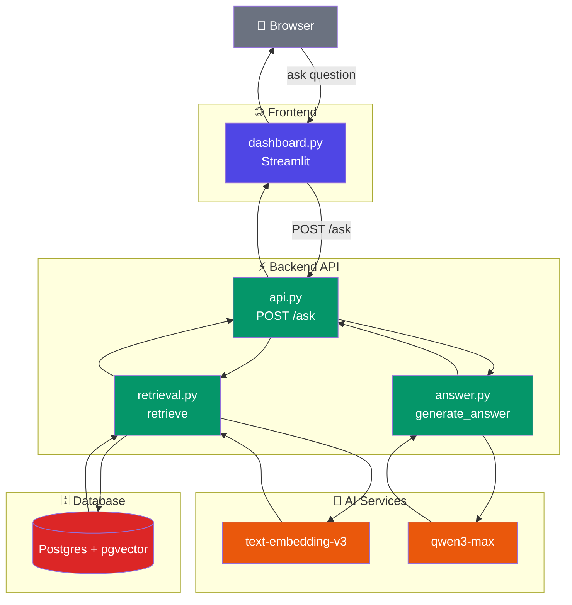

# SupportAgent

RAG pipeline over a real Confluence space + Jira project, for the
"Insurance Knowledge Search Dashboard" portfolio project. See
`architecture-proposal-v0.1.de.md` for the full design.

## Architecture (Prototype / MVP Deployment)



- `api.py` is a thin controller: it just calls `retrieve()` then `generate_answer()`.
- Two external calls go to DashScope: one to embed the question, one to generate
  the final answer from the retrieved chunks.
- The Streamlit dashboard calls the Vercel API server-to-server (`requests.post`),
  so no CORS configuration is needed.

## Screenshots

Dashboard: ask a German question and get an answer with cited, expandable sources.


`/ask` API schema (FastAPI Swagger UI):


The real Jira project (KAN) backing the "documentation gap" tickets used as sources:


## Setup

```bash
python -m venv .venv
source .venv/bin/activate
python -m pip install -e .
docker compose up -d postgres
```

Copy `.env.example` to `.env` and fill in:

- `ATLASSIAN_BASE_URL`, `ATLASSIAN_EMAIL`, `ATLASSIAN_API_TOKEN` - Confluence/Jira Cloud API token
- `CONFLUENCE_SPACE_KEY`, `JIRA_PROJECT_KEY` - the space/project to read from and write to
- `EMBEDDING_API_KEY` - Alibaba Cloud Model Studio (DashScope) API key, used via its
  OpenAI-compatible endpoint (`EMBEDDING_BASE_URL`) for both embeddings and chat (`CHAT_MODEL`)
- `DATABASE_URL` - points at the pgvector container started by `docker compose up`

## Pipeline

```bash
# 1. Seed the Confluence space + Jira project with sample insurance content
python -m supportagent.seed

# 2. Pull real Confluence pages (tagged "insurance-kb") + Jira issues, normalize to Documents
python -m supportagent.ingest

# 3. Chunk -> embed -> store in pgvector
python -m supportagent.index
```

## RAG Answer API

```bash
uvicorn supportagent.api:app --reload
```

`POST /ask` with `{"question": "..."}` retrieves relevant chunks from pgvector,
generates a German answer with citations (`[1]`, `[2]`, ...), and returns the
cited sources. If the retrieved context doesn't support an answer, it returns
a fixed controlled-refusal message instead.

### Agent workflow
The original MVP used a deterministic RAG pipeline:

  ```text
  question -> retrieve -> generate_answer
  ```

  The current version adds a minimal agent orchestration layer:

  ```text
  question
    -> route_question
    -> rewrite_query
    -> retrieve
    -> check_evidence
    -> generate_answer or controlled refusal
  ```

  **`route_question()`** decides whether the question should search Confluence,
  Jira, or both sources. The current implementation is rule-based and intentionally
  deterministic, so it is easy to test and debug.

  **`rewrite_query()`** expands user questions with insurance-domain terminology before retrieval. The rewritten query is used only for
  retrieval; answer generation still receives the original user question.

  **`check_evidence()`** validates the retrieved chunks before answer generation. If
  no chunks are retrieved, the workflow returns the controlled refusal text without
  calling the chat model.

  The FastAPI endpoint calls **`answer_with_agent()`**  instead of directly calling
  retrieval and answer generation. This keeps the API layer thin and leaves room
  for future agent steps such as query rewriting, second-pass retrieval, stronger
  evidence checks, or a LangGraph workflow.

### Evaluation

```bash
python -m supportagent.eval
```

Runs a small set of German questions (`eval_questions.py`) covering
single-source retrieval, multi-source synthesis, conflicting sources,
terminology robustness, and controlled refusal, and prints a pass/fail
report against the live pipeline.

## Dashboard

```bash
streamlit run supportagent/dashboard.py
```

A simple chat UI on top of `/ask` (run `uvicorn` first, see above): ask a
German question, filter by source (Confluence/Jira/all) in the sidebar, and
expand each cited source to preview its content and open the original
Confluence page or Jira issue. Set `API_BASE_URL` if the API isn't on
`http://localhost:8000`.

### PDF data prep

`pdf_to_confluence.py` extracts `§`-numbered sections from German insurance
terms PDFs (Musterbedingungen/AVB) into Confluence page drafts. See the
module docstring for the dry-run / save workflow.

## Project layout

- `models.py` - shared `Document` contract
- `html_utils.py`, `adf_utils.py` - Confluence storage-format HTML and Jira ADF conversions
- `atlassian_client.py` - real Confluence v2 / Jira v3 REST client
- `seed_content.py`, `seed.py` - sample data + script to create it in Confluence/Jira
- `ingest.py` - pulls real data back out and normalizes it to `Document`
- `chunking.py`, `embeddings.py`, `vector_store.py`, `index.py` - chunk/embed/store pipeline

## Tests

```bash
python -m pytest
```
