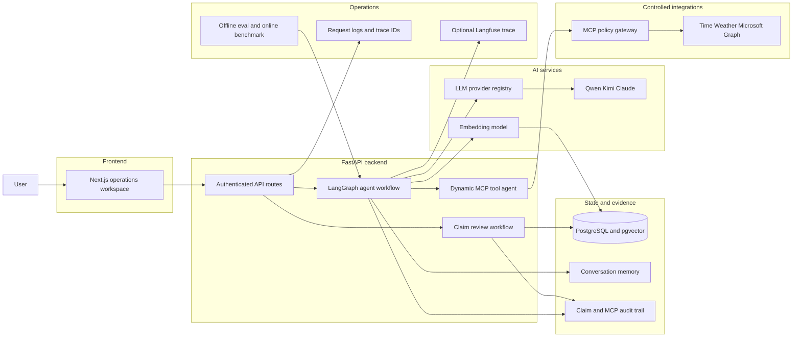

# SupportAgent

An evidence-bound insurance operations agent for claim review, RAG-assisted
answers, controlled MCP actions, and human approval. It is built as a
production-style portfolio project: you build it, run it, observe it, and
evaluate it.

## Architecture


```mermaid
flowchart LR
    user[User]

    subgraph frontend[Frontend]
        ui[Next.js operations workspace]
    end

    subgraph backend[FastAPI backend]
        api[Authenticated API routes]
        agent[LangGraph agent workflow]
        review[Claim review workflow]
        mcp_agent[Dynamic MCP tool agent]
    end

    subgraph data[State and evidence]
        postgres[(PostgreSQL and pgvector)]
        memory[Conversation memory]
        audit[Claim and MCP audit trail]
    end

    subgraph ai[AI services]
        embeddings[Embedding model]
        registry[LLM provider registry]
        models[Qwen Kimi Claude]
    end

    subgraph tools[Controlled integrations]
        policy[MCP policy gateway]
        services[Time Weather Microsoft Graph]
    end

    subgraph quality[Operations]
        logs[Request logs and trace IDs]
        evaluation[Offline eval and online benchmark]
        langfuse[Optional Langfuse trace]
    end

    user --> ui
    ui --> api
    api --> agent
    api --> review
    agent --> memory
    agent --> embeddings
    embeddings --> postgres
    agent --> registry
    registry --> models
    agent --> mcp_agent
    mcp_agent --> policy
    policy --> services
    review --> postgres
    review --> audit
    agent --> audit
    api --> logs
    agent --> langfuse
    evaluation --> agent
```

- The Operations UI supports German and English, persisted conversation threads,
  model selection, claim review, audit history, and controlled Calendar actions.
- FastAPI keeps HTTP, authentication, and policy boundaries separate from the
  LangGraph agent and claim-review workflows.
- The agent graph loads memory, optionally calls safe MCP tools, routes and
  rewrites the question, retrieves evidence from pgvector, then answers or
  returns a controlled refusal.
- Qwen, Kimi, and Claude are selected through a provider registry. Provider
  adapters normalize tool calls and token usage for observability and benchmark
  reporting.
- Write actions such as Microsoft Calendar creation require explicit confirmation,
  are audited, and use server-side idempotency to prevent duplicate events.

## Setup

```bash
python -m venv .venv
source .venv/bin/activate
python -m pip install -e .
docker compose up -d postgres
```

Copy `.env.example` to `.env` and fill in:

- `ATLASSIAN_BASE_URL`, `ATLASSIAN_EMAIL`, `ATLASSIAN_API_TOKEN` - Confluence/Jira Cloud API token
- `CONFLUENCE_SPACE_KEY`, `JIRA_PROJECT_KEY` - the space/project to read from and write to
- `EMBEDDING_API_KEY`, `EMBEDDING_BASE_URL` - embedding provider credentials
- `DASHSCOPE_API_KEY`, `DASHSCOPE_BASE_URL` - Qwen chat credentials; legacy
  installations fall back to `EMBEDDING_*`
- `OPENAI_API_KEY` / `ANTHROPIC_API_KEY` / `KIMI_API_KEY` - optional providers. Models from an
  unconfigured provider are not returned to the frontend
- `CHAT_MODELS` - model IDs allowed in the UI; `CHAT_MODEL` selects the default
- `CLAIM_REVIEW_MODEL`, `TOOL_MODEL`, `VISION_MODEL` - backend-owned task
  policies. These are not overridden by an ordinary chat model selection
- `DATABASE_URL` - points at the pgvector container started by `docker compose up`
- `AUTH_SESSION_TTL_DAYS`, `AUTH_COOKIE_SECURE` - local email/password session
  settings. Keep `AUTH_COOKIE_SECURE=false` for plain HTTP local development and
  set it to `true` when serving behind HTTPS.

## Backend layout

The backend follows a small service-oriented layout inspired by larger agent
platforms:

- `supportagent/api/` - FastAPI app, route registration, request/response schemas
- `supportagent/auth/` - local email/password auth, session cookies, user/session tables
- `supportagent/memory/` - short-memory and long-memory schemas, SQL store, service API
- `supportagent/rag/` - ingestion, chunking, embeddings, pgvector storage, retrieval
- `supportagent/agent/` - LangGraph workflow, routing, query rewrite, evidence checks
- `supportagent/llm/` - provider adapters, model registry, task policy routing
- `supportagent/integrations/` - external service clients such as Atlassian and Langfuse
- `supportagent/core/` - shared domain models, answer generation, logging setup

## One-command local startup

After Docker Desktop is running and `.env` is configured:

```bash
python scripts/start.py
```

Use `python3 scripts/start.py` if your system does not provide `python`.

The script installs missing frontend dependencies, starts the local pgvector
Postgres container, creates the memory tables for short-memory and long-memory,
then starts FastAPI at `http://127.0.0.1:8000` and Next.js at
`http://localhost:3000`. Press `Ctrl+C` to stop the frontend and backend;
Postgres remains running.

## Testing and CI

Backend tests are regular `pytest` tests with assertions and monkeypatching for
agent dependencies. Frontend checks use TypeScript and a production Next.js
build.

```bash
python -m pip install -e ".[dev]"
pytest

cd src/frontend
npm ci
npm run typecheck
npm run build
```

GitHub Actions in `.github/workflows/ci.yml` runs backend compile/tests,
frontend typecheck/build, and backend/frontend Docker image builds on pull
requests and pushes to `main`.

### Synthetic claim-review data

The repository includes source-backed document rules, synthetic claim fixtures
under `data/synthetic_claims.json`, and deterministic review cases under
`evals/claim_review.jsonl`. After registering a local user, seed the fixtures
explicitly with:

```bash
python scripts/seed_claim_demo.py --owner-email you@example.com --yes
```

The script refuses to create data without `--yes` and never reassigns an
existing synthetic claim to another user. Seeded document records are
metadata-only fixtures (`extracted_fields.synthetic = true`); they do not
pretend to contain downloadable PDF or image binaries. The Claims Desk shows
that distinction and exposes a file link only for records associated with a
real `uploaded_file_id`.

The Claims Desk uses two separate state models:

- claim lifecycle: `DRAFT` → `DOCUMENTS_PENDING`/`READY_FOR_REVIEW` →
  `UNDER_REVIEW` → `NEEDS_INFORMATION`/`READY_FOR_DECISION` →
  `APPROVED`/`REJECTED`
- review execution: `QUEUED` → `RUNNING` → `SUCCEEDED`/`FAILED`

Submitting a draft performs deterministic document validation. Starting a
review creates a persisted run, records each workflow step, stores the
evidence-backed result, advances the claim lifecycle, and exposes the history
in the case audit timeline. Approval and rejection are never selected by the
LLM: an authenticated human must confirm either terminal decision, and a
rejection requires a reason. The actor, decision, reason, and lifecycle
transition are persisted in the audit trail.

## Container startup

For only the local database:

```bash
docker compose up -d postgres
```

For the containerized app stack:

```bash
docker compose --profile app up --build
```

The app profile builds `Dockerfile.backend` and `src/frontend/Dockerfile`,
starts FastAPI on `http://localhost:8000`, Next.js on `http://localhost:3000`,
and uses the same pgvector Postgres service.

## Local MCP servers

The project includes local, enumerable MCP server examples under
`supportagent/mcp_servers/`. They are intended as interview-friendly reference
servers, not default remote third-party proxies.

### Multilingual time MCP

`time_mcp` exposes a read-only `get_current_time` tool backed by Python's IANA
timezone database. The dynamic tool agent uses it for live time questions and
answers in the language of the request:

```text
Wie spät ist es in Zürich?  -> German
What time is it in Zurich?  -> English
苏黎世现在几点了？             -> Chinese
```

The frontend enables this safe read-only server by default. The model formats
the answer, while the MCP tool remains the source of truth for the current time.

### Microsoft Teams / Graph MCP

`teams_mcp` mirrors the shape of the OmniAgent `lark_mcp` example, but maps the
tools to Microsoft Graph instead of Feishu/Lark:

- users: `batch_get_user_info`
- calendars: `create_calendar`, `delete_calendar`, `get_calendar_info`,
  `get_calendars_list`, `update_calendar`
- calendar events: `create_calendar_event`,
  `append_calendar_event_attendee`, `get_calendar_event`,
  `update_calendar_event`, `delete_calendar_event`
- OneDrive documents/folders: `create_document`, `get_document`,
  `create_folder`, `list_folder_files`
- Teams messages: `create_message`

Set `MS_GRAPH_ACCESS_TOKEN` or pass `access_token` to each tool. For a personal
account, an email such as `yuheydemann@outlook.de` can be used as `user_id` for
user/calendar/OneDrive tools. Sending Teams messages still requires a real
Microsoft Graph `chat_id`.

```bash
python -m supportagent.mcp_servers.teams_mcp --transport stdio
python -m supportagent.mcp_servers.teams_mcp --transport sse --host 127.0.0.1 --port 8010
```

### Google Weather MCP

`weather_mcp` exposes `get_weather(location | latitude/longitude)`. It uses
Google Geocoding when only a text location is provided, then calls Google
Weather for current conditions and daily forecast.

Set `GOOGLE_WEATHER_API_KEY` or `GOOGLE_MAPS_API_KEY`, or pass `api_key` to the
tool.

```bash
python -m supportagent.mcp_servers.weather_mcp --transport stdio
python -m supportagent.mcp_servers.weather_mcp --transport sse --host 127.0.0.1 --port 8011
```

Unlike the OmniAgent sample remote SSE entries, these servers do not auto-route
traffic through ModelScope or any unknown external MCP host. For production,
put a gateway/audit layer in front of Graph and Weather credentials before
letting users call these tools.

The chat endpoint also has a dynamic MCP path. On each `/ask`, the backend can
spawn the local MCP servers over stdio, call `list_tools`, expose allowed tools
to the chat model, execute model-selected `tool_calls` through `call_tool`, and
show those calls in the Agent trace. Write/action tools are not exposed to the
automatic agent unless `MCP_ALLOW_WRITE_TOOLS=true`.

```text
MCP config -> MultiServerMCPClient -> list_tools -> StructuredTool -> tool_calls
```

Set `MCP_DYNAMIC_TOOLS_ENABLED=false` to disable this automatic route and keep
only the manual MCP debug panel.

## Pipeline

```bash
# 1. Seed the Confluence space + Jira project with sample insurance content
python -m supportagent.seed

# 2. Pull real Confluence pages (tagged "insurance-kb") + Jira issues, normalize to Documents
python -m supportagent.rag.ingest

# 3. Chunk -> embed -> store in pgvector
python -m supportagent.rag.index
```

## RAG Answer API

```bash
uvicorn supportagent.api:app --reload
```

Register or sign in through the frontend first. The backend stores an
HTTP-only session cookie and resolves `user_id` server-side, so short memory is
scoped by `thread_id` and long memory is scoped by the authenticated user rather
than a frontend-supplied identifier.

`POST /ask` with `{"question": "..."}` retrieves relevant chunks from pgvector,
generates a German answer with citations (`[1]`, `[2]`, ...), and returns the
cited sources. If the retrieved context doesn't support an answer, it returns
a fixed controlled-refusal message instead.

### Agent workflow

The original MVP used a deterministic RAG pipeline:

  ```text
  question -> retrieve -> generate_answer
  ```

The current version adds a minimal agent orchestration layer:

  ```text
  question
    -> route_question
    -> rewrite_query
    -> retrieve
    -> check_evidence
    -> generate_answer or controlled refusal
  ```

**`route_question()`** decides whether the question should search Confluence,
Jira, or both sources. The current implementation is rule-based and intentionally
deterministic, so it is easy to test and debug.

**`rewrite_query()`** expands user questions with insurance-domain terminology before retrieval. The rewritten query is
used only for
retrieval; answer generation still receives the original user question.

**`check_evidence()`** validates the retrieved chunks before answer generation. If
no chunks are retrieved, the workflow returns the controlled refusal text without
calling the chat model.

The FastAPI endpoint calls **`answer_with_agent()`**  instead of directly calling
retrieval and answer generation. This keeps the API layer thin and leaves room
for future agent steps such as query rewriting, second-pass retrieval, stronger
evidence checks, or a LangGraph workflow.

### Evaluation

The default evaluation is deterministic, requires no external API keys, and
executes the production claim document and approval rules against the versioned
JSONL dataset:

```bash
python -m supportagent.evaluation
```

It writes a machine-readable report to
`artifacts/evals/claim-review-latest.json`, prints the metric thresholds, and
returns a non-zero exit code when a regression is detected. GitHub Actions runs
the same command and uploads the JSON report as the
`claim-review-evaluation` artifact.

The initial gated metrics are:

- claim case pass rate;
- missing-document exact-match rate;
- proposed-action exact-match rate;
- forbidden write-action execution rate.

The legacy live RAG check remains available:

```bash
python -m supportagent.eval
```

Runs a small set of German questions (`eval_questions.py`) covering
single-source retrieval, multi-source synthesis, conflicting sources,
terminology robustness, and controlled refusal, and prints a pass/fail
report against the live retrieval/generation pipeline. It requires indexed
pgvector data and real embedding/chat credentials, is not deterministic, and
is therefore not a CI gate.

### Online RAG / LLM benchmark

The online benchmark compares allowlisted Qwen, Kimi, and Claude models against
the same versioned RAG dataset and the same production `answer_with_agent()`
workflow. MCP tools and skills are disabled for this suite so that model
selection is the only intended variable.

Start with two cases and one trial per model:

```bash
python -m supportagent.evaluation.online_runner \
  --models qwen3-max,kimi-k2.6,claude-sonnet-4 \
  --cases household-standard-coverage,weather-out-of-domain-refusal \
  --trials 1 \
  --confirm-live
```

After the smoke run succeeds, run the interview benchmark with three trials:

```bash
python -m supportagent.evaluation.online_runner \
  --models qwen3-max,kimi-k2.6,claude-sonnet-4 \
  --trials 3 \
  --min-pass-rate 0.75 \
  --confirm-live
```

This executes 72 RAG requests (8 cases x 3 models x 3 trials), uses real
provider APIs, and may incur charges. It is intentionally excluded from CI.
The command writes both JSON and Markdown reports under `artifacts/evals/`.

The comparison reports:

- deterministic quality pass rate;
- expected-source recall;
- controlled-refusal accuracy;
- citation validity and response-language accuracy;
- stability across repeated trials and provider error rate;
- end-to-end p50/p95 latency and accumulated LLM latency;
- input, output, cached-input, and reasoning tokens;
- estimated cost when a dated pricing catalog covers every model call.

Token counts come from the provider response instead of a local tokenizer.
End-to-end latency includes retrieval and generation. Embedding requests are
therefore included in wall-clock latency, but their tokens and cost are not yet
included in the chat-token totals.

Pricing is deliberately separate from the recorded usage because provider
prices vary by region, account, model tier, and date. Copy
`evals/model_pricing.example.json` to the ignored
`evals/model_pricing.local.json`, add the current official Qwen and Kimi prices
for the configured account, and run:

```bash
python -m supportagent.evaluation.online_runner \
  --models qwen3-max,kimi-k2.6,claude-sonnet-4 \
  --trials 3 \
  --pricing evals/model_pricing.local.json \
  --confirm-live
```

The benchmark is a reproducible project comparison, not a universal model
leaderboard. Keep the prompt, indexed corpus, dataset, model ids, provider
region, and trial count fixed when comparing runs. The first quality gate uses
deterministic RAG checks; semantic correctness and groundedness judging are a
separate evaluation layer rather than being silently mixed into this score.

## Frontend

```bash
cd src/frontend
npm install
npm run dev
```

A Next.js chat UI on top of `/ask` (run `uvicorn` first, see above): ask a
German question, filter by source (Confluence/Jira/all), and expand each cited
source to preview its content and open the original Confluence page or Jira
issue. Set `BACKEND_API_URL` in `src/frontend/.env.local` if the FastAPI backend
isn't on `http://localhost:8000`.

### PDF data prep

`pdf_to_confluence.py` extracts `§`-numbered sections from German insurance
terms PDFs (Musterbedingungen/AVB) into Confluence page drafts. See the
module docstring for the dry-run / save workflow.

## Project layout

- `models.py` - shared `Document` contract
- `html_utils.py`, `adf_utils.py` - Confluence storage-format HTML and Jira ADF conversions
- `atlassian_client.py` - real Confluence v2 / Jira v3 REST client
- `seed_content.py`, `seed.py` - sample data + script to create it in Confluence/Jira
- `ingest.py` - pulls real data back out and normalizes it to `Document`
- `chunking.py`, `embeddings.py`, `vector_store.py`, `index.py` - chunk/embed/store pipeline
- `src/backend/supportagent` - FastAPI, LangGraph workflow, ingestion, retrieval, and indexing code
- `src/frontend` - Next.js frontend that proxies `/api/ask` to FastAPI

## Tests

# End-to-end tests

测试完整链路：

1. 启动 Postgres
2. 启动 FastAPI
3. 启动前端
4. 用户访问 Assistant 页面
5. 发送问题
6. 前端调用 `/ask`
7. 后端返回 answer、sources 和 trace
8. 前端显示结果或错误信息

```bash
python -m pytest
```
